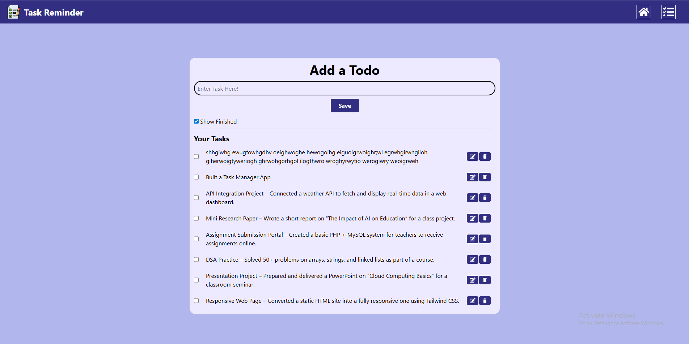

# 📝 Task Reminder - Todo App

A simple and clean **Todo App** built with **ReactJS** and **TailwindCSS**.  
This app allows you to add, edit, and delete tasks. You can mark tasks as **done** and view completed ones by toggling the **"Show Finished"** option.

---

## 🚀 Features
- ➕ Add new tasks
- ✏️ Edit existing tasks
- ❌ Delete tasks
- ✅ Mark tasks as complete
- 👀 Toggle to show/hide finished tasks
- 🎨 Modern UI using **TailwindCSS**
- ⚡ Built with **ReactJS**

---

## 📸 Showcase
Here’s a preview of the app in action:



---

## 🛠️ Tech Stack
- **ReactJS** – Frontend framework  
- **TailwindCSS** – Styling  
- **LocalStorage** – For saving tasks persistently  

---

## 📂 Project Setup

1. **Clone the repository**
   ```bash
   git clone https://github.com/AMAN02SS/Task-Manager-Reactjs-.git
   cd Task-Manager-Reactjs-
